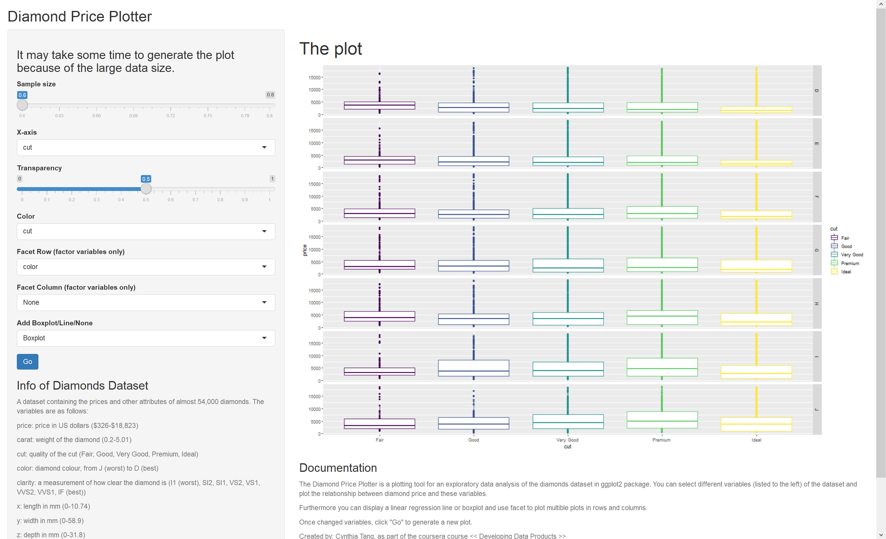

Diamond Pprice Plotter Pitch Presentation
========================================================
author: Cynthia Tang 
width: 1440
height: 900
date: June 30, 2019
autosize: true

Introduction
========================================================

* The Diamond Price Plotter is a tool used to plot the relationship between diamond price and
other variables.  
* Users can customize the sample size, x-axis, transparency and color of the points, 
facet plots by rows and columns. The default plot type is a scatter plot. Users can
choose to add linear regression lines or boxplots if necessary.   
* Everytime users changed the configuration of the plot, press "Go" buttom to generate the new plot.  
* Diamonds dataset contains the prices and other attributes of almost 54,000 diamonds. The variables are as follows: 
  + price: price in US dollars (\$326-\$18,823)  
  + carat: weight of the diamond (0.2-5.01)  
  + cut: quality of the cut (Fair, Good, Very Good, Premium, Ideal)  
  + color: diamond colour, from J (worst) to D (best)  
  + clarity: a measurement of how clear the diamond is (I1 (worst), SI2, SI1, VS2, VS1, VVS2, VVS1, IF (best))  
  + x: length in mm (0-10.74)  
  + y: width in mm (0-58.9)  
  + z: depth in mm (0-31.8)  
  + depth: total depth percentage = z / mean(x, y) = 2 * z / (x + y) (43-79)  
  + table: width of top of diamond relative to widest point (43-95) 

UI.R code
========================================================


```r
library(shiny)
library(ggplot2)

var <- names(diamonds)[-7]
var <- c("None", var)
# Define UI for application that draws a scatter plot
shinyUI(
        fluidPage(
                titlePanel("Diamond Price Plotter"),
                sidebarLayout(
                        sidebarPanel(
                                h3("It may take some time to generate the plot because of the large data size."),
                                sliderInput("p", "Sample size", min = 0.6, max = 0.8,
                                            value = 0.6, step = 0.01),
                                selectInput("x", "X-axis", choices = var, 
                                            selected = var[2]),
                                sliderInput("alpha", "Transparency", min = 0, max = 1, 
                                            value = 0.1, step = 0.05),
                                selectInput("col", "Color", choices = var, 
                                            selected = var[1]),
                                selectInput("frow", "Facet Row (factor variables only)", choices = var[c(1, 3:5)], 
                                            selected = var[1]),
                                selectInput("fcol", "Facet Column (factor variables only)", choices = var[c(1, 3:5)], 
                                            selected = var[1]),
                                selectInput("ele", "Add Boxplot/Line/None", 
                                            choices = c("Boxplot", "Line", "None"),
                                            selected = "None"),
                                submitButton("Go"),
                                h3("Info of Diamonds Dataset"),
                                helpText("A dataset containing the prices and other attributes of almost 54,000 diamonds. The variables are as follows:"),
                                helpText("price: \n price in US dollars ($326-$18,823)"),
                                helpText("carat: \n weight of the diamond (0.2-5.01)"),
                                helpText("cut: \n quality of the cut (Fair, Good, Very Good, Premium, Ideal)"),
                                helpText("color: \n diamond colour, from J (worst) to D (best)"),
                                helpText("clarity: \n a measurement of how clear the diamond is (I1 (worst), SI2, SI1, VS2, VS1, VVS2, VVS1, IF (best))"),
                                helpText("x: \n length in mm (0-10.74)"),
                                helpText("y: \n width in mm (0-58.9)"),
                                helpText("z: \n depth in mm (0-31.8)"),
                                helpText("depth: \n total depth percentage = z / mean(x, y) = 2 * z / (x + y) (43-79)"),
                                helpText("table: \n width of top of diamond relative to widest point (43-95)")
                        ),
                        mainPanel(
                                h1("The plot"),
                                plotOutput("plot", height = "800px" ),
                                h3("Documentation"),
                                helpText("The Diamond Price Plotter is a plotting tool for an exploratory data analysis of the diamonds dataset in ggplot2 package. You can select different variables (listed to the left) of the dataset and plot the relationship between diamond price and these variables."),
                                helpText("Furthermore you can display a linear regression line or boxplot and use facet to plot multible plots in rows and columns."),
                                helpText("Once changed variables, click \"Go\" to generate a new plot."),
                                helpText("Created by: Cynthia Tang, as part of the coursera course << Developing Data Products >>")
                        )
                )
        )
)
```

Server.R code
========================================================


```r
library(shiny)
library(ggplot2)

shinyServer(function(input, output) {
   
  output$plot <- renderPlot({

          p <- as.numeric(input$p)
          data <- reactive({
                  obs <- nrow(diamonds)
                  set.seed(1234)
                  rindex <- sample(1:obs, size = p * obs, replace = FALSE)
                  diamonds[rindex, ]
          }) 
          
          col <- ifelse(input$col == "None", "NULL", input$col)
          p <- ggplot(data(), aes_string(x = input$x, y = "price", color = col)) +
                  geom_point(alpha = as.numeric(input$alpha))
          if(input$frow != "None" | input$fcol != "None"){
                  if(input$frow != "None" & input$fcol != "None") form <- paste(input$frow, "~", input$fcol)
                  else if(input$frow != "None" & input$fcol == "None") form <- paste(input$frow, "~.")
                  else form <- paste(".~", input$fcol)
                  p <- p + facet_grid(as.formula(form), scales = "free")
          }
          if(input$ele == "Boxplot"){
                  p <- p + geom_boxplot()
          } else if(input$ele == "Line") {
                  p <- p + geom_smooth(method = "lm", color = "red")
          }
          p
  })
  
})
```

Sample Inerface of the App
========================================================

Link: [Diamond Price Plotter](https://xctang.shinyapps.io/DiamondPrice/); 
[Github repo](https://github.com/XYCynthiaT/DevDatProducts/tree/master/DiamondPrice)

